<div align="center">

# 🧠 SynapseCore
## **Digital Psychiatry Workbench**

*A clinician-facing, AI-augmented platform for structured mental health assessments*

</div>

<div align="center">

### Status & Technology

[](.)
[](LICENSE)
[](#)
[](#)

[](.)
[](.)
[](.)
[](.)

</div>

---

## Extended High‑Level Overview


SynapseCore is a clinician‑facing, AI‑augmented workbench for psychiatry. It addresses persistent problems in clinical practice: documentation burden, fragmented tooling across risk/safety workflows, and variable adoption of Measurement‑Based Care (MBC). The application consolidates validated symptom scales, structured clinical flows (e.g., safety reviews, capacity, agitation), and a session timer into a single workspace that favors clarity, auditability, and reproducibility.

From a psychiatric perspective, SynapseCore is designed as a "thinking scaffold" for the clinician. It foregrounds symptom quantification (PHQ‑9, GAD‑7, PCL‑5, Y‑BOCS, AUDIT‑C), explicit risk formulation, and capacity reasoning, while deliberately avoiding black‑box decision support. It is suitable for teaching trainees how to structure assessments, for consultation‑liaison work on busy medical wards, and for longitudinal follow‑up in outpatient or community clinics.

Technically, SynapseCore is a React/TypeScript single‑page application (Vite build) with a modular AI orchestration layer that can target multiple model providers (OpenAI, Anthropic, Gemini, and local Ollama). Sampling parameters are normalized across providers; streaming responses and telemetry are first‑class; and safety guardrails (PII‑like and secret redaction, risky command detection) are included. Observability hooks expose spans and metrics through OpenTelemetry‑compatible interfaces for methodical evaluation in research or quality‑improvement contexts.

Typical usage contexts include outpatient follow‑up, consultation‑liaison (CL) psychiatry, academic seminars, OSCE training, and quality‑improvement projects. In each scenario, SynapseCore aims to standardize inputs (MBC), structure assessments (flows), and accelerate documentation while explicitly keeping the clinician in the loop.

> IMPORTANT — NOT A MEDICAL DEVICE: SynapseCore does not diagnose, predict outcomes, or make autonomous treatment decisions. It does not implement triage algorithms, risk calculators, or capacity determinations. Use under the supervision of licensed clinicians and according to local policies. The clinician remains responsible for the clinical record, risk formulation, and disposition.

---

## Quickstart


### Prerequisites

- **Node.js:** v20.x LTS (or later compatible with Vite 6).
- **Package manager:** `npm` (bundled with Node).
- **Environment:** development use is intended on a local machine or secure institutional workstation.

Minimal environment variables (development examples):

```bash
set VITE_OPENAI_API_KEY=sk-...           # if using OpenAI
set VITE_ANTHROPIC_API_KEY=...          # if using Anthropic (optional)
set VITE_GEMINI_API_KEY=...             # if using Gemini (optional)
set VITE_OLLAMA_BASE_URL=http://localhost:11434  # if using Ollama (optional)
```

In production, these should be set via your platform’s secret manager or environment configuration, not committed to source control.

### Install and run (development)

```bash
npm install
npm run dev
```

By default, Vite serves the app on `http://localhost:5173` (or `http://localhost:3000` if you use the `dev:safe` script). The main SPA entry loads at the root path (`/`).

### First‑run example: Safety flow + PHQ‑9 + AI summary

1. **Enter PHQ‑9 (and optionally GAD‑7):**
  - Open the MBC/scale panel and enter responses.
  - Verify that totals, bands, and any item‑9 flags appear in the autoscore HTML.
2. **Complete the safety flow:**
  - Open the structured safety flow (ideation, plan, means, protective factors, observation).
  - Ensure each section is completed with neutral, clinician‑authored text.
3. **Request an AI‑assisted summary (optional):**
  - Open the AI panel and choose a provider/model configured for your environment.
  - Send a prompt that includes the safety flow outcome and a short summary of the PHQ‑9 results (e.g., “Generate a concise safety‑focused summary; do not make recommendations.”).
4. **Edit and export:**
  - Review the streamed draft carefully; edit, shorten, or discard sections as needed.
  - Use the export/print panel to generate a note snippet suitable for pasting into your clinical record system (subject to local policy).

Throughout this workflow, all clinical decisions remain with the clinician; AI is used only as a drafting aid.

## Key Features (Clinical + Technical), Expanded

- **Multi‑model AI orchestration (grounded in code):**
  The provider registry and capabilities are defined in `src/ai/modelRegistry.ts` (e.g., static model lists, `getCaps`, and dynamic listing via provider clients in `src/ai/providerClients/*`). Provider‑specific request builders live in `src/ai/samplingMapper.ts` and encode differences across OpenAI (`/chat/completions`), Anthropic (`/messages`), Gemini (`:generateContent`), and Ollama (`/api/chat`). Normalization and safety metadata accompany each request (e.g., `jsonModeApplied`, `topPSupported`).

- **Deterministic MBC calculators with autoscore HTML:**
  `src/features/psychiatry/mbc/calculators.ts` implements PHQ‑9, GAD‑7, PCL‑5, Y‑BOCS, and AUDIT‑C with strict clamping and explicit severity bands. Functions return totals, band labels, and flags (e.g., PHQ‑9 item 9 > 0 → “discuss safety”). `renderAutoscoreHTML(...)` generates a compact HTML snippet that surfaces items, totals, severity, and anchors suitable for printing or export.

  Clinically, these instruments approximate latent constructs:

  - **PHQ‑9 (depressive symptom burden):** frequency of core depressive symptoms over the last 2 weeks, focusing on anhedonia, mood, sleep, energy, appetite, self‑worth, concentration, psychomotor change, and thoughts of death.
  - **GAD‑7 (generalized anxiety):** excessive worry, tension, restlessness, irritability, and somatic anxiety symptoms over 2 weeks.
  - **PCL‑5 (PTSD‑related symptoms):** intrusions, avoidance, negative alterations in cognition and mood, and hyperarousal over the last month.
  - **Y‑BOCS (obsessive‑compulsive severity):** time, interference, distress, resistance, and control for obsessions and compulsions.
  - **AUDIT‑C (alcohol use patterns):** frequency and intensity of drinking and heavy episodic use.

  Typical neutral clinical questions these tools support include:

  - Is symptom burden improving or worsening over time?
  - Do current scores and change trajectories support considering a treatment adjustment?
  - Is there a signal suggesting trauma‑related symptoms, obsessive‑compulsive severity, or hazardous alcohol use that merits discussion?

- **Structured clinical flows (builders → outcome prose):**
  Flow builders under `src/centerpanel/Flows/builders/*` (e.g., `safetyOutcome.ts`, `capacityOutcome.ts`, `agitationOutcome.ts`) convert structured selections into concise, safety‑first narrative suitable for handoffs and notes. Builders centralize wording and include timestamping (see `src/centerpanel/Flows/time`).

  These flows are intentionally conservative: they support, but never replace, the clinician’s own risk formulation and capacity assessment. For example, the safety flow ensures the clinician explicitly records ideation, intent, plan, access to means, protective factors, and an observation/risk management plan in neutral language.

- **Session timer and session analytics (TF.js):**
  The timer subsystem (`src/centerpanel/timerHooks/*`) provides a metronome, calendar integration, and persistence. `useSessionML.ts` uses TensorFlow.js to learn on‑device patterns from local session histories (stored in localStorage/IndexedDB) and suggest the next segment type/duration. By default, no PHI leaves the browser.

- **Developer‑facing IDE surface:**
  An embedded IDE (`src/components/ide/*`) and file explorer (`src/components/file-explorer/*`) support content and flow authoring. `src/services/editorBridge.ts` exposes `insertIntoActive`, `openNewTab`, and `replaceSelection` with language inference for common fenced blocks. This is particularly helpful for prototyping flows or note templates alongside clinical modules.

- **Observability and telemetry:**
  `src/observability/otel.ts` provides tracer/meter shims that can be bound at runtime via `window.__otel_setup(AppConfig)`. `src/observability/spans.ts` exports `withSpan(...)` to wrap async work, and `src/observability/aiRouteTelemetry.ts` debounces and emits AI route changes (e.g., provider/model switches), optionally surfacing in‑app toasts.

- **Guardrails and redaction:**
  `src/services/ai/guardrails/redact.ts` applies pattern‑based redaction across secrets, PII‑like strings, risky commands, and potential exfiltration URLs. Guardrail warnings are emitted and can fail CI in hardened pipelines via `npm run guardrails:ci`.

- **State management and persistence:**
  Global state is managed with Zustand (see `package.json` and `src/store`/`src/stores`). Timers, drafts, and histories use localStorage/IndexedDB (e.g., `useSessionML.ts`). Canary and feature flags read from URL params, localStorage, and `import.meta.env` (`src/config/flags.ts`).

---

## Deep Architecture Overview


### Layered view
- UI layer: clinical flows (`src/centerpanel/Flows/*`), timer (`src/centerpanel/timerHooks/*`), MBC outputs, and IDE/file explorer (`src/components/ide/*`, `src/components/file-explorer/*`).
- AI orchestration: registry, request builders, adapters, parameter normalization (`src/ai/*`, `src/services/ai/*`, `src/hooks/useAiStreaming.ts`).
- Clinical logic: calculators and flow builders (`src/features/psychiatry/*`, `src/centerpanel/Flows/builders/*`).
- Observability: tracer/meter initialization and span helpers (`src/observability/*`).
- Configuration and theming: app config, flags, tokens (`src/config/*`, `src/theme`, `src/ui/theme`).

#### Diagram 1 — High‑level component architecture

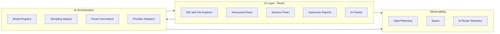

#### Diagram 2 — End‑to‑end data flow (“start safety flow + AI summarisation”)
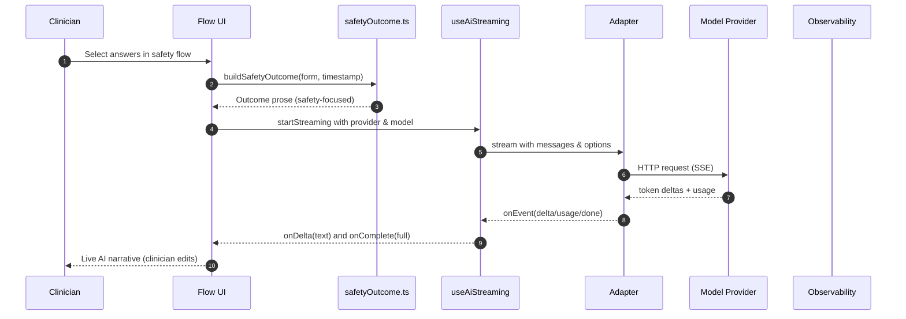

---

## UI Layout Overview

The core layout can be understood as three cooperating regions: a left rail for navigation and MBC, a central workspace for flows and notes, and right/secondary panels for AI, export, and utilities.

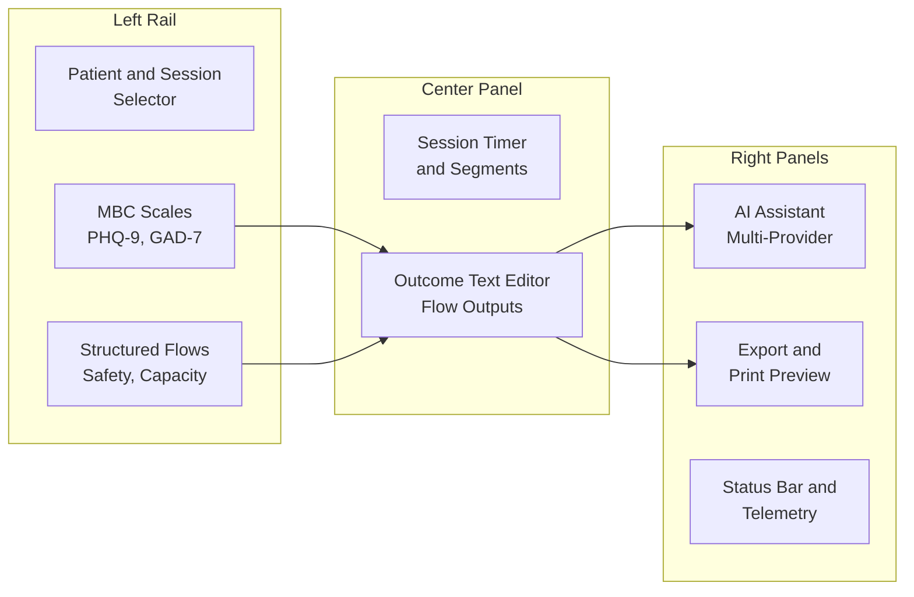

This diagram is intentionally abstract; concrete component trees live under `src/centerpanel`, `src/components/ai`, `src/components/ide`, and `src/components/terminal`.

#### Diagram 3 — Module dependency overview

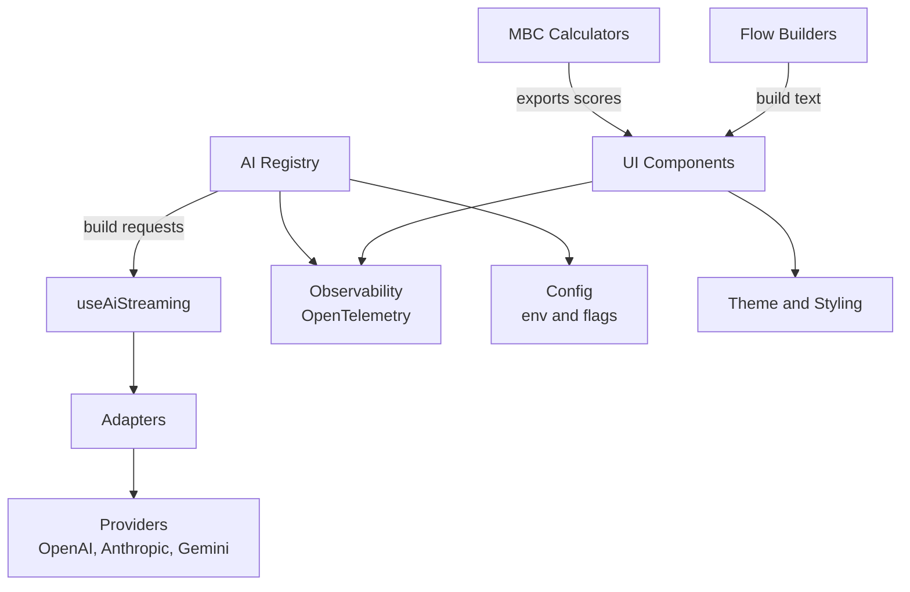

---

  ## Configuration Cookbook

  Most runtime behaviour is controlled via a small number of environment variables and config objects in `src/config/env.ts` and `src/config/flags.ts`. This section summarises the main toggles.

  ### Environment and tracing flags (`src/config/env.ts`)

  `CONFIG` is derived from `VITE_PROFILE` (`dev` \| `staging` \| `prod`) and includes tracing/metrics controls:

  | Field | Source | What it controls | Typical dev value | Typical prod value |
  | --- | --- | --- | --- | --- |
  | `CONFIG.profile` | `VITE_PROFILE` | Global profile; affects defaults | `dev` | `prod` |
  | `CONFIG.flags.enableTracing` | hard‑coded `true` | Whether OpenTelemetry spans are produced in the browser | `true` (OK; send to local collector) | `true`, but route to institutional collector |
  | `CONFIG.flags.enableMetrics` | hard‑coded `true` | Whether basic metrics are recorded | `true` | `true`, subject to governance |
  | `CONFIG.otel.otlpEndpoint` | `VITE_OTLP_HTTP` | OTLP HTTP endpoint for spans/metrics | `http://localhost:4318/v1/traces` | Institutional OTEL/collector endpoint |
  | `CONFIG.otel.samplingRatio` | derived from profile | Fraction of spans sampled | `1.0` | e.g. `0.15` |

  ### Feature flags and canary controls (`src/config/flags.ts`)

  The `flags` object combines environment variables, query‑string parameters, and `localStorage` keys:

  | Flag | Env / storage | Meaning | Recommended dev | Recommended prod |
  | --- | --- | --- | --- | --- |
  | `flags.aiTrace` | `VITE_AI_TRACE`, `?trace=1`, `localStorage['synapse.flags.aiTrace']` | Extra AI tracing / debugging output | Often `true` for debugging | Usually `false` except on internal test tenants |
  | `flags.a11yEnabled` | `?a11y=1`, `localStorage['synapse.flags.a11y']` | Enables additional accessibility affordances in the UI | Encourage `true` | Encourage `true` |
  | `flags.simpleStream` | `VITE_SIMPLE_STREAM`, query/localStorage | Chooses simpler streaming path for AI outputs | `true` by default | `true` unless advanced streaming is needed |
  | `flags.synapseCoreAI` | `VITE_SYN_CORE_AI`, query/localStorage | Master switch for SynapseCore AI panel | `true` | `true` or institution‑specific |
  | `flags.consultonAI` | `VITE_CONSULTON_AI` \| `VITE_FEATURE_CONSULTON_AI` | Enables experimental Consulton AI flows | `true` to test | `false` or tightly gated canary |
  | `flags.consultonAICanaryPercent` | `VITE_CONSULTON_CANARY_PERCENT` | Percentage of clients included in canary rollout | e.g. `50` | Low values (e.g. `5`–`10`) |

  LLM provider credentials are injected via `import.meta.env` (e.g., `VITE_OPENAI_API_KEY`, `VITE_ANTHROPIC_API_KEY`, `VITE_GEMINI_API_KEY`, `VITE_OLLAMA_BASE_URL`) and read in the AI adapter layer. They must **never** be hard‑coded in the repository.

  ## Security & Deployment Checklist (Conceptual)

  The following checklist is intended for teams deploying SynapseCore‑like tooling in institutional environments. It does not replace institutional security reviews.

  1. **Environment / secrets management**
    - Store `VITE_*_API_KEY` values and OTLP endpoints in your platform’s secret manager.
    - Ensure build pipelines do not echo secrets in logs.
  2. **Transport security**
    - Serve the app only over HTTPS in production.
    - Ensure all AI provider calls are made over HTTPS and pinned to official endpoints.
  3. **Telemetry routing and sampling**
    - Set `VITE_OTLP_HTTP` to a trusted, institution‑controlled collector.
    - Tune `CONFIG.otel.samplingRatio` to balance observability and data minimisation.
    - Verify that no PHI is placed into span attributes, logs, or metric labels.
  4. **Guardrails and redaction**
    - Treat `src/services/ai/guardrails/redact.ts` as mandatory; do not bypass it in production.
    - Run `npm run guardrails:ci` in CI and fail builds when redaction warnings are emitted for representative samples.
  5. **Network and perimeter controls**
    - Place the app behind an institutional reverse‑proxy or gateway that terminates TLS and enforces authentication/authorisation.
    - Consider a WAF / API gateway with rate‑limiting and egress controls for AI provider endpoints.
  6. **Data residency and logging**
    - Confirm where AI providers store or process data; configure “no log” / “zero retention” modes when available.
    - Ensure local logs/metrics do not contain identifiers and are retained only as long as necessary for QI/monitoring.
  7. **Policy and governance alignment**
    - Obtain sign‑off from clinical governance, digital safety, and (where applicable) IRB/QI boards before using with real patient data.
    - Document which AI features are enabled for which user groups (e.g., trainees vs. consultants) and under what supervision.

  These points are **conceptual guidance** and must be adapted to local policies, threat models, and regulatory requirements.

  ---

## Clinical Concepts, Methodology, and Safety Boundaries

This section summarizes the clinical concepts embedded in the codebase and clarifies how they are used as scaffolding rather than as automated decision makers.

### Measurement‑Based Care (MBC)

MBC refers to the routine use of validated instruments to measure symptom burden and treatment response over time. In SynapseCore, calculators are deterministic and transparent (`src/features/psychiatry/mbc/calculators.ts`). Each function:

1. Coerces and clamps item inputs to valid ranges.
2. Computes a total score.
3. Maps that score to a severity band.
4. Emits structured flags that prompt clinician review (e.g., PHQ‑9 item 9 > 0 → consider discussing safety and supports).

Brief conceptual summaries of the included scales:

| Scale | Construct (conceptual) | Example neutral question it supports |
| --- | --- | --- |
| PHQ‑9 | Depressive symptom burden over 2 weeks | Is the patient’s depressive symptom burden stable, improving, or worsening relative to prior visits? |
| GAD‑7 | Generalized anxiety severity | Are anxiety symptoms remaining functionally impairing despite current treatment? |
| PCL‑5 | Trauma‑related symptoms (PTSD clusters) | Are trauma‑related intrusions/avoidance/hyperarousal persisting at a level that warrants targeted intervention? |
| Y‑BOCS | Obsessive‑compulsive severity | Has the severity of obsessions/compulsions changed in a way that may affect functioning or risk? |
| AUDIT‑C | Hazardous/harmful alcohol use | Is there a pattern of alcohol use that merits discussion of safety, health, or support options? |

All scoring and banding are deterministic; there is no machine learning in the calculators themselves.

### Extending the Scale Library (Walkthrough)

To add a new validated scale in a way that is consistent with existing calculators:

1. **Add a calculator in `calculators.ts`:**
  - Define a typed function `newScaleScore(items: number[]): { total: number; band: string; flags: {...} }`.
  - Clamp item responses to the instrument’s allowed range and compute the total using a transparent formula.
2. **Define severity bands and anchors:**
  - Encode band thresholds (e.g., `none`, `mild`, `moderate`, `severe`) and document anchor text based on the published instrument.
  - Return both the numeric band index and a human‑readable label.
3. **Wire into the MBC UI:**
  - Add the new scale to the MBC configuration (item labels, response options, scoring function) so it appears in the scale picker.
  - Ensure autoscore HTML includes items, total, band, and any relevant flags.
4. **Update documentation tables:**
  - Add a new row to the MBC tables in this `README` describing the construct, score range, and severity anchors.
5. **Integrate with export and flows (optional):**
  - Where clinically appropriate, make the new scale’s summary available to flows and AI prompts (e.g., brief insert into safety or longitudinal summary prompts).

For any new instrument, clinical content and anchors must be derived from the original validation literature or institutional guidance; the repository should remain transparent and deterministic about how scores are computed and interpreted.

#### Scale-specific vector notation and scoring functions

For clarity, we can index each instrument with its own response vector and scoring function. Let

- $`x^{(phq)} = (x^{(phq)}_1, \dots, x^{(phq)}_9)`$ with $`x^{(phq)}_i \in \{0,1,2,3\}`$,
- $`x^{(gad)} = (x^{(gad)}_1, \dots, x^{(gad)}_7)`$ with $`x^{(gad)}_i \in \{0,1,2,3\}`$,
- $`x^{(pcl)} = (x^{(pcl)}_1, \dots, x^{(pcl)}_{20})`$ with $`x^{(pcl)}_i \in \{0,1,2,3,4\}`$,
- $`x^{(ybocs)} = (x^{(ybocs)}_1, \dots, x^{(ybocs)}_{10})`$ with $`x^{(ybocs)}_i \in \{0,1,2,3,4\}`$,
- $`x^{(audit)} = (x^{(audit)}_1, x^{(audit)}_2, x^{(audit)}_3)`$ with $`x^{(audit)}_i`$ in the AUDIT-C item ranges.

Each measure $`m \in \{phq, gad, pcl, ybocs, audit\}`$ has an associated scoring function

$$ s_m : X_m \to \mathbb{R}, \quad s_m\big(x^{(m)}\big) = \sum_{i=1}^{n_m} w^{(m)}_i x^{(m)}_i, $$

where $X_m$ is the clamped item domain, $n_m$ is the number of items for measure $m$, and the implementation in `calculators.ts` uses fixed $w^{(m)}_i$ (typically 1). For AUDIT‑C, severity interpretation depends additionally on sex and item pattern (e.g., heavy episodic use); the scoring function itself remains a simple sum.

Severity bands for each measure are intervals in the one‑dimensional score space of $s_m$:

$$ B^{(m)}_k = [a^{(m)}_k, b^{(m)}_k] \subseteq \mathbb{R}, \qquad k = 1, \dots, K_m. $$

The calculator returns both the numeric score $s_m\big(x^{(m)}\big)$ and the band label corresponding to the unique $k$ such that $s_m\big(x^{(m)}\big) \in B^{(m)}_k$.

Red‑flag conditions are Boolean‑valued indicator functions over the item vectors. For example, for PHQ‑9 item 9:

$$ r_{phq,9}\big(x^{(phq)}\big) = \begin{cases}
1 & \text{if } x^{(phq)}_9 > 0, \\
0 & \text{otherwise.}
\end{cases} $$

and for an illustrative high‑severity Y‑BOCS band (e.g., total $\geq 24$ in this codebase):

$$ r_{ybocs,\text{severe}}\big(x^{(ybocs)}\big) = \mathbf{1}\big[s_{ybocs}(x^{(ybocs)}) \ge 24\big]. $$

In all cases, these indicator functions are implemented as flags in the result objects (e.g., `hasItem9Flag`, `hasHeavyUseFlag`) and are used only to suggest topics for discussion, not to drive automated decisions.

#### Measurement noise and observed vs. latent scores (conceptual)

From a psychometric perspective, it is often useful to distinguish a (hypothetical) latent true score $s^{true}_m$ from an observed score $s^{obs}_m$, writing conceptually

$$ s^{obs}_m = s^{true}_m + \varepsilon_m, $$

where $\varepsilon_m$ is a measurement error term capturing day‑to‑day variability, response inconsistency, and context effects. The calculators in this repository operate only on $s^{obs}_m$; no latent‑trait modelling, item‑response theory, or formal error estimation is implemented.

When clinicians interpret change across visits, this conceptual decomposition reminds us that small fluctuations may reflect noise, whereas sustained, clinically coherent changes across multiple timepoints are more likely to reflect genuine change in the underlying construct.

#### Longitudinal trajectories over time (conceptual)

When instruments are administered repeatedly, each measure yields a time series of observed scores

$$ s^{obs}_m(t_1), s^{obs}_m(t_2), \dots, s^{obs}_m(t_T), $$

with $t_1 < t_2 < \dots < t_T$ denoting visit times. Clinicians often reason informally about:

- **Level:** the typical magnitude of $s^{obs}_m(t)$ over a window;
- **Trend:** whether scores are increasing, decreasing, or stable (e.g., a slope estimate from a simple linear fit);
- **Variability:** how much scores fluctuate around a trend line.

SynapseCore does not compute statistical trend tests or slopes; it simply provides transparent scores over time that can be plotted or inspected. Any formal time‑series modelling (e.g., estimating a slope $\beta_m$ in $s^{obs}_m(t) = \alpha_m + \beta_m t + \varepsilon_t$) would be performed in downstream analytic environments and is **conceptual/illustrative only** here.

#### MBC across visits — conceptual diagrams

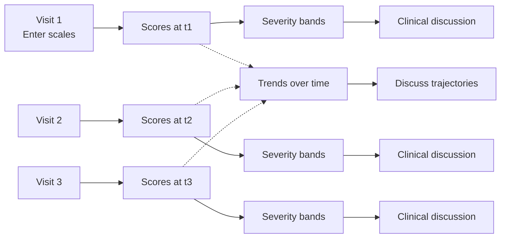

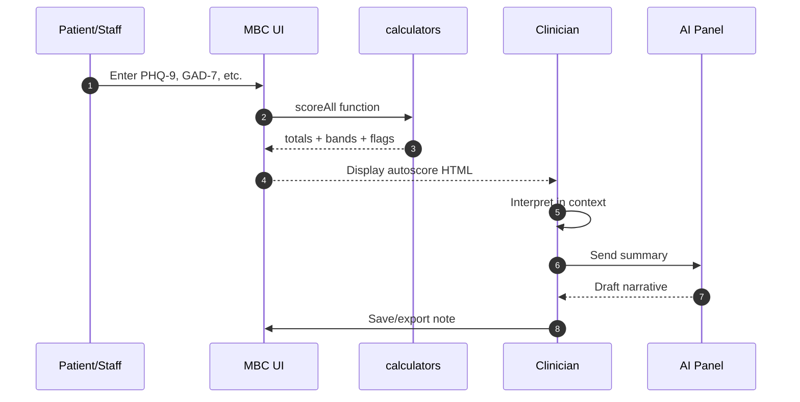

### Structured flows and real‑world assessments


Flow builders (e.g., safety, capacity, agitation, catatonia, observation) encode clinically neutral phrasing that can be edited by the clinician. For example, `safetyOutcome.ts` constructs sentences about ideation, intent/plan, access to means, protective factors, and observation strategy with explicit disclaimers regarding scope and local policy.

These flows are intentionally designed to support:

- **Risk formulation:** making explicit the presence/absence of suicidal ideation, plans, means, protective factors, recent stressors, and agreed observation strategies.
- **Capacity assessments:** clarifying understanding, appreciation, reasoning, and expression of a choice in a particular decision context.
- **Agitation management:** documenting early warning signs, triggers, de‑escalation strategies, and thresholds for increased observation.

At every step, flows help the clinician say "what I actually assessed" rather than "what the model decided." They never output a disposition recommendation.

### Risk and Case Formulation Support (Conceptual)

SynapseCore is designed to scaffold, not replace, clinical formulation. In many services, formulation is structured around predisposing, precipitating, perpetuating, and protective factors. We can think of a (highly simplified) formulation map as:

$$ F : (S, R, C, P) \to \text{Text} $$

where:

- $S$ aggregates symptom information (e.g., MBC scores and salient symptoms described in prose).
- $R$ aggregates risk‑relevant information (e.g., ideation, plans, means, past attempts, substance use, and protective factors documented in flows).
- $C$ aggregates capacity‑relevant information (e.g., understanding, appreciation, reasoning, choice) for a specific decision.
- $P$ aggregates contextual and psychosocial factors (e.g., recent stressors, supports, housing, medical comorbidity) captured in free text.

In practice, SynapseCore provides structured inputs to each of these components:

- MBC calculators give a transparent, reproducible $S$.
- Safety and substance‑related flows provide structured building blocks for $R$.
- Capacity flows provide a scaffold for documenting the elements of $C$.
- Free‑text fields and IDE/AI tooling support narrative capture of $P$.

Any AI‑generated text can be viewed as a draft $\tilde{F}(S, R, C, P)$ that must be reviewed, corrected, or discarded by the clinician. The true clinical formulation remains a human judgement that integrates additional information (collateral, exam findings, longitudinal knowledge, team input) that may not be represented in the app.

### Psychiatric Use Cases and Example Workflows

This subsection describes abstracted use cases to illustrate how MBC, flows, timer, and AI orchestration interact. Examples are intentionally generic and not patient‑specific.

#### 1. Outpatient depression follow‑up

- **Goal:** Track depressive symptom burden over time and streamline narrative documentation.
- **Path through the app:**
  - Enter PHQ‑9 and GAD‑7 responses → `phq9Score`, `gad7Score` → `renderAutoscoreHTML`.
  - Use the safety flow if item 9 is non‑zero, documenting ideation context and supports.
  - Use AI summarisation on the autoscore HTML plus safety outcome to generate draft prose for the progress note, then edit.

This supports neutral questions such as "Is symptom burden improving over time?" and "Do scores and narrative support considering a treatment adjustment?" without making that decision.

#### 2. Consultation‑liaison (CL) review on a medical ward

- **Goal:** Structure a complex assessment (e.g., delirium vs. depression vs. adjustment) and clearly document risk and capacity elements.
- **Path through the app:**
  - Complete relevant scales (e.g., PHQ‑9, GAD‑7) if appropriate.
  - Use the safety flow to document ideation, intent, and observation decisions.
  - Use the capacity flow to structure documentation of understanding, appreciation, reasoning, and choice for a specific treatment decision.
  - Use the session timer to track assessment/liaison time.

The result is a structured narrative that supports multidisciplinary handoff and care planning.

#### 3. Safety check in an emergency department (ED) context

- **Goal:** Ensure that key elements of a safety assessment are documented, even under time pressure.
- **Path through the app:**
  - Optionally capture PHQ‑9 item 9 or a brief ideation screen.
  - Use the safety flow to document ideation, plan, means, protective factors, and collaborative safety steps.
  - Avoid AI use if local policies restrict it; or, if allowed, use AI summarisation only on de‑identified text and edit rigorously before export.

This supports the clinician in making a clear risk formulation and describing immediate safety steps, but does not calculate risk scores or dispositions.

#### 4. Longitudinal symptom tracking in a clinic

- **Goal:** Track trajectories across multiple visits and support stepped‑care decisions.
- **Path through the app:**
  - Repeatedly enter PHQ‑9, GAD‑7, and other relevant scales at each visit.
  - Export autoscore HTML or summaries to an external dashboard or EHR.
  - Optionally use AI summarisation to provide a brief, structured “since‑last‑visit” narrative.

This enables visualization of trends (e.g., persistently high PTSD symptoms, improving depression) without algorithmic triage.


### Intended workflows

1. **Pre‑visit:** patients or staff enter scale responses; autoscore HTML is generated. Outliers (e.g., PHQ‑9 item 9 > 0, very high Y‑BOCS) are flagged deterministically to prompt clinician review.
2. **During visit:** clinician uses flows (e.g., safety, capacity) and optionally requests an AI summary of the outcome text to accelerate note‑writing.
3. **Post‑visit:** edit, export, and archive in accordance with local policy; telemetry aids QI and research without PHI.

> WARNING — NOT A MEDICAL DEVICE: This software aids documentation and standardization only. It does not replace clinical judgement, consultation, or local policy requirements and does not provide risk scores, diagnoses, or recommended dispositions.

### Safety principles

- **Human oversight:** clinicians control edits and final text; generated content is always editable.
- **Transparency:** provider/model selection and prompts are visible; route changes are logged.
- **Reversibility:** flow inputs stay editable; generated text can be discarded at any time.
- **Auditability:** autoscore anchors and flow outputs are explicit, time‑stamped, and linked to the underlying inputs.

#### Diagram 4 — Clinically meaningful sequence (PHQ‑9 → AI summary → export)
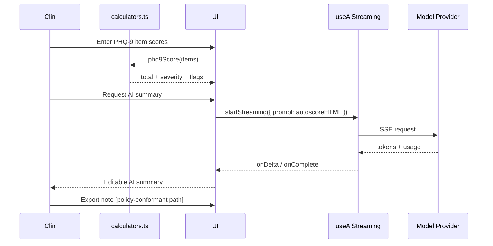

---

## AI Orchestration Layer (Scientific and Technical Detail)

### Registry, request building, and normalization
- `src/ai/modelRegistry.ts` defines static models and capabilities (streaming, JSON mode, token limits) for providers and offers `listModelsDynamic(...)` via `src/ai/providerClients/*`. IDs are normalized (e.g., Gemini `models/` prefix stripping).
- `src/ai/samplingMapper.ts` provides provider‑specific request builders (`buildOpenAI`, `buildAnthropic`, `buildGemini`, `buildOllama`, `buildCustom`) and returns a `BuiltProviderRequest` with sanitized headers and meta.
- `src/services/ai/param-normalizer.ts` clamps `temperature`, `topP`, and `maxOutput`, and maps normalized parameters to each provider JSON schema.

#### Mathematical view of prompts, parameters, and provider mapping

We can describe the AI orchestration layer in terms of abstract spaces and maps:

- Let $`P`$ denote the **prompt space**, consisting of prompt text plus structured metadata (e.g., role, clinical vs. non-clinical context, safety notes).
- Let $`\Theta`$ denote a **canonical sampling parameter space**, e.g., $`\theta = (T, p, M, J)`$ for temperature $`T`$, top-p $`p`$, max tokens $`M`$, JSON-mode flag $`J`$, etc.
- For each provider $`p`$ (OpenAI, Anthropic, Gemini, Ollama, ...), let $`\Theta_p`$ be the provider-specific parameter space (JSON schema) and let $`N_p : \Theta \to \Theta_p`$ be the **parameter normalisation map** implemented by `param-normalizer.ts` plus provider-specific helpers in `samplingMapper.ts`.

Given a context object $`c`$ in the UI (e.g., flow outcome text + options), we can write:

1. A **prompt builder**: $`\text{buildPrompt} : C \to P,\quad p = \text{buildPrompt}(c)`$.
2. A **provider call map**: $`\Phi_p : P \times \Theta_p \to Y`$, where $`Y`$ is the space of model outputs (streaming tokens, final text, usage metadata).

The overall (non-streaming) call can then be expressed as the composition $`\Phi_p(\text{buildPrompt}(c),\, N_p(\theta))`$.


$$ \text{call}_p(c, \theta) = \Phi_p\big(\text{buildPrompt}(c), N_p(\theta)\big), $$

which matches the structure of `buildProviderRequest` followed by an adapter’s HTTP call.

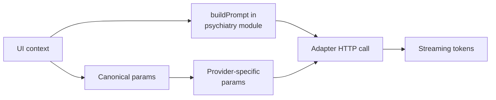

#### Streaming outputs as sequences


In practice, providers return streaming outputs that we can model as finite sequences

$$ y = (y_1, y_2, \dots, y_K), $$

where each $y_k$ is a token delta, character chunk, or partial text, and $K$ may vary per call. `useAiStreaming.ts` exposes these as `onDelta` callbacks; the UI folds the partial outputs to maintain a running concatenation

$$ Y^{(k)} = y_1 \oplus y_2 \oplus \dots \oplus y_k. $$

Here $\oplus$ denotes string concatenation (or a structured merge, e.g., for JSON). The final output $Y^{(K)}$ is what the clinician sees and edits.

#### Conceptual cost functions over tokens

Many providers publish approximate per‑token prices for prompt and completion tokens. Conceptually, one can define a per‑interaction cost

$$ C_p \approx \alpha_p \cdot T_p + \beta_p \cdot T_c, $$

where $T_p$ and $T_c$ are the prompt and completion token counts reported in usage metadata, and $(\alpha_p, \beta_p)$ are provider‑specific unit costs derived from pricing pages. **This cost model is conceptual only and must be calibrated against up‑to‑date provider documentation in any real deployment.**

Telemetry hooks (see below) can, in principle, aggregate such costs to support budgeting and QI, again without emitting PHI.

### Streaming orchestration and backpressure
`src/hooks/useAiStreaming.ts` coordinates provider selection and failover using adapters in `src/services/ai/adapters`. It queues jobs, handles abort signals, emits window events during failover (`ai:providerSwitch`), and reports usage deltas for downstream cost/metrics. The hook exposes `onDelta` and `onComplete` callbacks designed for incremental UI rendering.

#### Provider capabilities (from `modelRegistry.ts`)

| Provider | Streaming | JSON mode | Top‑p supported | Token limit (approx.) |
|---|---|---|---|---:|
| OpenAI | yes | yes | yes | 128,000 |
| Anthropic | yes | no | yes | 200,000 |
| Gemini | yes | no | yes | 1,000,000 |
| Ollama | yes | no | yes | 8,192 |

> Note: tool‑calling interfaces exist in `services/ai/adapters/types.ts` but tool adapters may be deployment‑specific.

Conceptually, one can also think in terms of a simple **model capability matrix** that guides which family to use for a given task. This is not a routing algorithm and does not encode any clinical logic; routing is configured explicitly in code.

| Family (illustrative) | Typical context window | Strengths (non‑clinical) | Example uses in this project |
|---|---:|---|---|
| OpenAI GPT‑style | up to O($10^5$) tokens | General summarisation, rewriting, light JSON extraction | Drafting visit summaries, re‑phrasing safety narratives, generating neutral export text |
| Anthropic Claude‑style | up to O($10^5$–$2\times10^5$) tokens | Long‑context reading, cautious text generation | Summarising long notes or registry views into short, clinician‑editable bullets |
| Gemini‑style | up to O($10^6$) tokens (provider‑specific) | Very long context, multimodal in some tiers | Experimental long‑document synthesis, research/teaching examples |
| Ollama (local) | model‑dependent (smaller) | Local experimentation, offline scenarios | Testing prompts and flows without sending content to external providers |

All numbers above are **approximate and conceptual**; any real deployment must consult, and keep in sync with, the actual provider documentation and organisational policies.

#### Diagram 5 — AI pipeline sequence

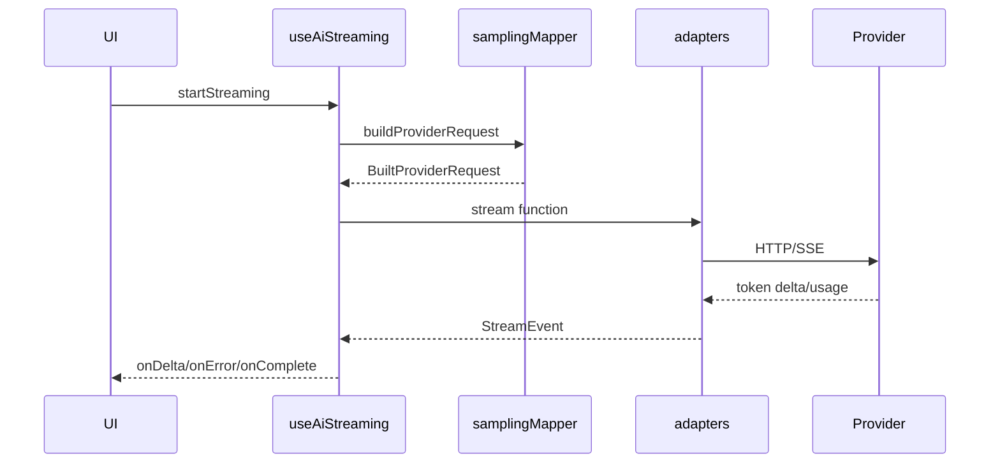

#### Example — invoke AI from a feature
```ts
import { buildProviderRequest } from '@/ai/samplingMapper';

const built = buildProviderRequest({
  provider: 'openai',
  model: 'gpt-4o',
  sampling: {
    temperature: 0.6,
    top_p: 0.9,
    max_tokens: 600,
    json_mode: false,
    system_prompt: 'You are a careful clinical scribe. Keep safety language neutral.'
  },
  apiKey: '[INJECT AT RUNTIME OR VIA SETTINGS]',
  prompt: 'Generate 4 bullet points summarizing the safety outcome.',
});
// built.request: { url, method, headers, body }
```

---

## Measurement‑Based Care (MBC) Engine (Psychometric and Mathematical Grounding)

The MBC module (`src/features/psychiatry/mbc/calculators.ts`) contains typed scoring functions:

- `phq9Score(items)`: 9 items, 0–3 each; flags on item 9 > 0. Used for depression screening and severity tracking.
- `gad7Score(items)`: 7 items, 0–3 each; general anxiety severity tracking.
- `pcl5Score(items)`: 20 items, 0–4 each; totals ≥ 33 suggest probable PTSD (screen). Cluster checks (B/C/D/E) are reported.
- `ybocsScore(items)`: 10 items, 0–4 each; severity banding for OCD symptom burden.
- `auditCScore(items, sex)`: 3 items; sex‑dependent thresholds; flags heavy episodic use.

`renderAutoscoreHTML(measure, answers, opts)` outputs a small printable section that includes item table, totals, severity, and anchors.

### Mathematical Formulation of Symptom Scales

For a given instrument with $n$ items, we can represent the item response vector as

$$ x = (x_1, x_2, \ldots, x_n) \in X \subseteq \mathbb{Z}^n $$

where the domain $X$ encodes allowed response ranges (e.g., PHQ‑9: $x_i \in \{0,1,2,3\}$ for all $i$).

The scoring function for most scales in this repository is a simple weighted sum:

$$ s : X \to \mathbb{R}, \quad s(x) = \sum_{i=1}^{n} w_i x_i $$

where $w_i$ are fixed item weights (typically $w_i = 1$). No learned or adaptive weights are used.

Severity banding is represented as a partition of the score space into intervals:

$$ B_k = \{ x \in X : s(x) \in [a_k, b_k] \}, \quad k = 1, \ldots, K $$

For example, for PHQ‑9:

- $B_1$ (None/Minimal): $s(x) \in [0,4]$
- $B_2$ (Mild): $s(x) \in [5,9]$
- $B_3$ (Moderate): $s(x) \in [10,14]$
- $B_4$ (Moderately severe): $s(x) \in [15,19]$
- $B_5$ (Severe): $s(x) \in [20,27]$

The calculators return both $s(x)$ and the index (or label) of the band $B_k$ that contains $x$.

#### Red‑flag logic as Boolean indicator functions

Red‑flag conditions are encoded as simple Boolean indicator functions. For PHQ‑9 item 9 (thoughts of death or self‑harm):

$$ r_{\text{phq9}} (x) = \begin{cases}
1 & \text{if } x_9 > 0 \\
0 & \text{otherwise}
\end{cases} $$

In code, this appears as a flag field on the result object rather than a direct recommendation. Similar indicator functions exist for AUDIT‑C heavy episodic use, high PCL‑5 totals, and severe Y‑BOCS bands.

These flags are designed to say "this pattern often warrants a conversation" rather than "do X".

#### Worked example — PHQ‑9 scoring, banding, and red‑flag (illustrative)

Consider a single PHQ‑9 response vector

$$ x^{(phq)} = (2, 2, 1, 1, 2, 1, 0, 1, 1), $$

where each coordinate is on the usual 0–3 scale. The total score is

$$ s_{phq}(x^{(phq)}) = 2+2+1+1+2+1+0+1+1 = 11. $$

Comparing $11$ to the banding above, we have $11 \in [10,14]$, so this falls in the **Moderate** band ($B_3$).

For the red‑flag indicator tied to item 9 (thoughts of death or self‑harm), the same vector gives $x^{(phq)}_9 = 1$, hence

$$ r_{\text{phq9}}(x^{(phq)}) = 1. $$

In the implementation, this is returned as a Boolean field; UI components may render it as a visual flag or neutral text (e.g., "Item 9 > 0 — please review safety together"). The library does **not** suggest a particular action.

A conceptual example of what a downstream UI card might show:

| Quantity | Value | Interpretation |
|---|---:|---|
| PHQ‑9 total $s_{phq}(x)$ | 11 | Falls in Moderate band (10–14) |
| Severity band $B_k$ | $B_3$ | Label: "Moderate" |
| Item 9 response $x_9$ | 1 | Any value $> 0$ sets red‑flag indicator |
| Red‑flag $r_{phq9}(x)$ | 1 (true) | "Consider focused safety discussion" (text, not advice) |

This example is **illustrative only**; actual numbers and labels are taken directly from the underlying calculator functions and published PHQ‑9 anchors.

#### From raw responses → autoscore HTML

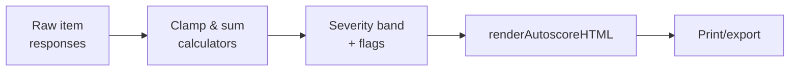

| Scale | Items | Range | Selected anchors |
|---|---:|---:|---|
| PHQ‑9 | 9 | 0–27 | None (0–4), Mild (5–9), Moderate (10–14), Moderately severe (15–19), Severe (20–27) |
| GAD‑7 | 7 | 0–21 | None (0–4), Mild (5–9), Moderate (10–14), Severe (15–21) |
| PCL‑5 | 20 | 0–80 | Subthreshold (0–32), Probable PTSD (≥33), with B/C/D/E cluster checks |
| Y‑BOCS | 10 | 0–40 | Subclinical (0–7), Mild (8–15), Moderate (16–23), Severe (24–31), Extreme (32–40) |
| AUDIT‑C | 3 | 0–12 | Sex‑specific screen thresholds; heavy episodic flag on Q3 ≥ 4 |

> FHIR/EHR integration: out of scope in this repository. Scoring outputs are intentionally transparent and could be mapped to FHIR resources in downstream systems. [ADD LINK OR POLICY IF APPLICABLE]

#### Combined view — MBC scores, flows, AI, and export (conceptual)

The following schematic summarises how autoscores, structured flows, AI summarisation, and export tooling can be composed in a **single visit**, while keeping the clinician in control at each stage:

- **Measurement‑Based Care (MBC)**  
  `Item responses → Score calculators → Totals & bands`
- **Structured Flows**  
  `Safety UI → Flow builders → Baseline narrative`
- **AI Orchestration (optional)**  
  `Baseline narrative + MBC scores → Prompt → Streaming → AI summary`
- **Export**  
  `AI summary → Clinician review/edit → Export panel / print`

All arrows represent **clinician‑controlled steps**; AI is used only as an editable drafting aid on text the clinician has already authored or selected.

This diagram is **conceptual** and describes a typical composition pattern; concrete wiring is visible in feature modules under `src/features` and `src/centerpanel/Flows`.

---

## Structured Clinical Flows and Session Timer


### Flows as structured decision/state machines

Flow builders in `src/centerpanel/Flows/builders/*` assemble outcome text from normalized inputs. For example, `safetyOutcome.ts` derives sentences for ideation, intent/plan, access to means, protective factors, and observation, then appends a policy reminder.

Formally, we can model a flow as a finite state machine:

$$ \mathcal{F} = (S, s_0, A, T, O) $$

where:

- $S$ is the set of states (e.g., `Intake`, `Ideation`, `Plan`, `Means`, `Protective`, `Observation`, `Outcome`).
- $s_0 \in S$ is the initial state (e.g., `Intake`).
- $A$ is the set of actions/inputs (clinician selections, checkboxes, free‑text snippets).
- $T: S \times A \to S$ is the transition function.
- $O: S \times A \to \text{Text}$ is the output function producing intermediate sentences.

`buildSafetyOutcome(config)` can be viewed as a deterministic mapping:

$$ f_{\text{safety}} : C \to \text{Text} $$

where $C$ is the space of configuration objects collected from the flow UI. There is no randomness; the same inputs always produce the same baseline narrative.

For the safety flow, one illustrative (non‑exhaustive) formalization is:

- $S = \{s_{intake}, s_{ideation}, s_{plan}, s_{means}, s_{protective}, s_{observation}, s_{outcome}\}$,
- $A$ includes actions such as `setIdeationStatus`, `setPlanDetail`, `setMeansAccess`, `setProtectiveFactors`, `setObservationPlan`,
- $T$ advances the state in response to actions (e.g., $T(s_{ideation}, setPlanDetail) = s_{plan}$),
- $O$ appends neutral prose snippets at each step (e.g., "Ideation was described as ...").

The overall flow can also be visualised as a directed acyclic graph (DAG) over this finite state space: edges represent allowed transitions, and the outcome node has no outgoing edges. In this implementation, transitions are encoded implicitly in the builder logic and UI wiring rather than as a separate graph structure.

#### Safety Flow Workflow

The safety flow guides clinicians through seven structured stages:

1. **Intake** — Entry point where clinician begins the assessment.
2. **Ideation** — Assess presence or absence of suicidal thoughts; document explicitly.
3. **Plan** — Assess specificity and detail of any stated plan; record findings neutrally.
4. **Means** — Assess access to methods and lethality; document availability and context.
5. **Protective Factors** — Identify and document patient strengths, supports, and protective elements.
6. **Observation & Management** — Determine and document recommended observation level and safety plan details.
7. **Outcome** — Generate a neutral, clinician-editable narrative summarizing the assessment.

Each stage builds on prior information, and the clinician remains in control at every step. The outcome is a prose summary suitable for the clinical record.

---

#### Capacity Assessment Workflow

Capacity assessment follows a structured framework based on established clinical principles:

1. **Clinical Context** — Establish the decision to be made and the clinical circumstances.
2. **Understanding** — Assess whether the patient can comprehend relevant information presented in clear language.
3. **Appreciation** — Assess whether the patient can apply that information to their own situation.
4. **Reasoning** — Assess whether the patient can logically deliberate among options and consequences.
5. **Expression of Choice** — Assess whether the patient can communicate a clear, consistent choice.
6. **Outcome Documentation** — Record findings neutrally without binary judgment; the clinician makes the final determination.

The capacity builder (`capacityOutcome.ts`) supports documenting each of these elements in text and generating a structured narrative. It does not output a binary "capacity" or "incapacity" decision; that judgement remains with the clinician based on local standards and policy.

#### Markov‑chain view of flow usage (conceptual)

Ignoring clinical semantics and focusing only on how often clinicians move between screens, one can (conceptually) treat the safety or capacity flow as a Markov chain over the state set $S$.

For a given flow, define an $|S| \times |S|$ transition count matrix $N$ where $N_{ij}$ is the number of observed transitions from state $i$ to state $j$ in logs. A row‑normalized transition matrix $P$ is then

$$ P_{ij} = \frac{N_{ij}}{\sum_k N_{ik}} \quad (\text{when } \sum_k N_{ik} > 0). $$

This matrix $P$ captures typical navigation patterns (e.g., how often clinicians return from `Observation` to `Plan` to adjust wording). **This Markov‑chain analysis is conceptual only and is not implemented in this repository.** Any such analysis would have to be done on anonymised aggregated telemetry under appropriate governance.

#### Non‑goals and clinical boundaries (summary)

To reiterate and make the boundaries explicit, SynapseCore tooling is designed to assist documentation and structured note‑taking. It does **not** perform clinical reasoning or make treatment decisions.

| This system **does** | This system **does not** |
|---|---|
| Compute transparent symptom scale totals and bands (e.g., PHQ‑9, GAD‑7) | Diagnose depression, anxiety, PTSD, OCD, SUD, or any other condition |
| Help structure risk and capacity narratives into neutral prose | Compute or output suicide risk scores, probabilities, or recommendations |
| Generate draft summaries from explicitly provided text/configuration (via AI orchestration) | Decide on involuntary holds, level of care, medication changes, or legal actions |
| Provide timers and segment labels to organise sessions | Track or infer identity, demographics, or longitudinal outcomes outside the local browser context |
| Support exports (e.g., print‑ready notes) controlled and edited by the clinician | Replace clinical judgement, supervision, or institutional policy |

Any deployment in a clinical environment must treat this as documentation tooling only and ensure local policies, consent, and governance are followed.

### Session timer, segments, and session analytics


The timer stack (`src/centerpanel/timerHooks/*`) tracks segments, laps, and pauses and persists to localStorage. Conceptually, a session is a finite sequence of labeled time segments:

$$ \text{Session} = \{ (t_i, \ell_i) \}_{i=1}^N $$

where $t_i \in \mathbb{R}_{\ge 0}$ is the duration of segment $i$ and $\ell_i$ is a label (e.g., `Assessment`, `Psychoeducation`, `MedicationReview`, `Supervision`).

`useSessionML.ts` defines a lightweight neural model (TensorFlow.js) that, if enabled, learns a mapping from recent history to suggested next segment type/duration:

$$ f: \text{History} \to \mathcal{P}(L) $$

where `History` is a pseudonymized sequence of past session segments and $\mathcal{P}(L)$ is a probability distribution over the set of labels $L$. Importantly, training data are local to the browser and should exclude direct identifiers; predictions are suggestions only and are safe to ignore.


#### Derived session features and basic distributions (conceptual)

From the raw segments $`\{(t_i, \ell_i)\}_{i=1}^N`$, we can construct a feature vector summarizing a session in a way that is potentially useful for anonymised analytics or local `useSessionML`-style models:

1. **Total duration**: $`T_{\mathrm{total}} = \sum_{i=1}^{N} t_i`$.

2. **Per-label time allocation**

   For each label $`\ell`$ in the label set $`L`$, define
   $`T_\ell = \sum_{i:\,\ell_i=\ell} t_i`$
   and
   $`p(\ell) = \frac{T_\ell}{T_{\mathrm{total}}}`$
   with the condition $`T_{\mathrm{total}} > 0`$.

   The vector
   $`v = \big(T_{\mathrm{total}}, \{T_\ell\}_{\ell \in L}, N, \{p(\ell)\}_{\ell \in L}\big)`$
   is a simple session feature representation capturing both absolute and relative time allocation.

3. **Segment-count features**

   Counts of segments per label
   $`n_\ell = |\{i : \ell_i = \ell\}|`$
   can be added to the feature vector to characterize how fragmented a session is.


  These features are **conceptual/illustrative** only and are not reported to any external service by default. In principle, they could be computed locally and used as inputs to on‑device models (e.g., to predict likely next segments), but any such analytics must respect privacy constraints and institutional governance.

  ```mermaid
  flowchart LR
    Seg["Raw segments<br/>time & labels"] --> Agg["Aggregate<br/>totals & counts"]
    Agg --> Feat["Session feature<br/>vector"]
    Feat -->|Conceptual| ML["useSessionML or<br/>offline analytics"]
  ```

---

## Developer‑Facing IDE / Tooling (with Visual Metaphors)

The in‑app IDE (`src/components/ide/*`) and file explorer (`src/components/file-explorer/*`) enable content authoring, flow editing, and quick prototyping. `src/services/editorBridge.ts` exposes a simple API:

- `insertIntoActive({ code, language? })`: append to the active editor or open a new tab.
- `openNewTab({ filename, code, language? })`: create a new file and tab, with language detection.
- `replaceSelection({ code, language? })`: replace active tab content (with undo stack support).

#### Diagram 6 — Typical developer workflow

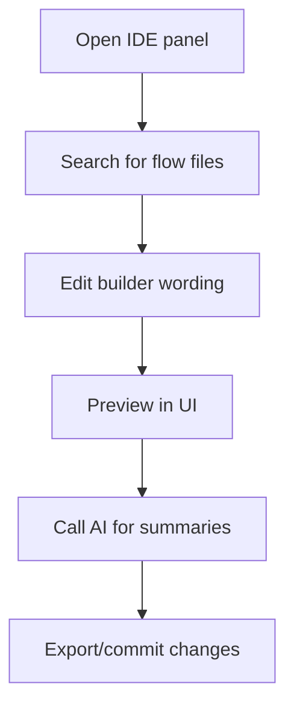

---

## Installation, Build, and Run

### Prerequisites
- Node.js 20+ (ESM, Vite 6, React 19).
- Modern Chromium/Firefox/Safari browsers.
- Optional: local Ollama (`http://localhost:11434`) for on‑device models.
- Cloud provider API keys as applicable (entered via your deployment’s settings pattern or env wiring).

### Quickstart (common)
```bash
# clone
git clone [ADD REPO URL]
cd coder-app

# install
npm install

# dev server
npm run dev

# typecheck and build
npm run type-check
npm run build

# preview (static server)
npm run preview
```

### Quickstart for Clinicians (local sandbox)
1. Install Node.js 20+.
2. Run `npm install` then `npm run dev`.
3. In the UI, use local features: MBC calculators, flows, and the session timer.
4. Optionally enable local models with Ollama; leave cloud providers unset.

### Quickstart for Developers
1. Configure environment (see next section) for your providers and telemetry.
2. Start dev server: `npm run dev`.
3. Explore AI orchestration hooks in `src/hooks/useAiStreaming.ts` and provider mappings in `src/ai/samplingMapper.ts`.
4. Add new flows under `src/centerpanel/Flows/builders/*` and new scales in `src/features/psychiatry/mbc/calculators.ts`.

---

## Configuration, Environment, and Theming (Reference)

### Environment/config values

| Key | Source | Effect |
|---|---|---|
| `VITE_PROFILE` | env | App profile: `dev`/`staging`/`prod` (`src/config/env.ts`). Influences tracing sampling ratios and rate limits. |
| `VITE_OTLP_HTTP` | env | OTLP HTTP endpoint for telemetry export (`src/config/env.ts`). Optional. |
| `VITE_E2E` | env | Enables test‑mode timeouts for streaming (`src/config/flags.ts`). |
| `VITE_SIMPLE_STREAM` | env/URL/localStorage | Toggles simplified streaming mode (`src/config/flags.ts`). |
| `VITE_CONSULTON_AI` / `VITE_FEATURE_CONSULTON_AI` | env | Primary AI feature flag gate (`src/config/flags.ts`). |
| `VITE_CONSULTON_CANARY` / `VITE_CONSULTON_CANARY_PERCENT` | env | Canary rollout control with stable bucketing (`src/config/flags.ts`). |
| `VITE_CONSULTON_DISABLE` | env | Global kill switch (disables Consulton AI features) (`src/config/flags.ts`). |

> Flags also accept URL query and localStorage overrides; see `src/config/flags.ts`.

### Theming
`src/theme/synapse.ts` defines a `synapseTheme` with color tokens, radii, spacing, shadows, and a focus ring helper.

```ts
import { synapseTheme } from '@/theme/synapse';

const ring = synapseTheme.focusRing(2); // CSS helper for accessibility focus
```

Additional tokens live in `src/ui/theme/*` (typography scales, spacing). Override `--syn-*` CSS variables or extend the theme object to brand deployments.

---

## Telemetry, Analytics, and Privacy

### Design specification
- Initialization: `src/observability/otel.ts` binds tracer/meter from `window.__otel_setup(AppConfig)` if present; otherwise no‑ops.
- Span taxonomy: UI events and AI calls should wrap in `withSpan(name, attrs, fn)` (`src/observability/spans.ts`).
- Metrics: histograms/counters include `req_latency_ms`, `tokens_prompt`, `tokens_completion`, `cost_usd`, `errors_total`, `rate_limit_hits`, `cache_hits`.
- Route changes: `src/observability/aiRouteTelemetry.ts` debounces provider/model switches and emits events, optionally surfacing toasts for operator awareness.

### Conceptual Risk and Evaluation Metrics

Telemetry metrics allow researchers and QI teams (in appropriately governed deployments) to study system behaviour without accessing PHI. Conceptually, one can define session‑ or interaction‑level evaluation functions from the available counters.

Let:

- $L$ = average request latency in milliseconds (`req_latency_ms`).
- $T_p$ = number of prompt tokens (`tokens_prompt`).
- $T_c$ = number of completion tokens (`tokens_completion`).
- $E$ = error rate over some window (`errors_total` / `requests_total`).

In a fully anonymised research context, one might define a conceptual utility function such as:

$$ U = \alpha \cdot \text{notesSimplificationScore} - \beta \cdot L - \gamma \cdot E $$

where $\alpha, \beta, \gamma > 0$ are weights chosen by the evaluator and `notesSimplificationScore` is a human‑rated or automatically scored outcome (e.g., readability or length reduction). This is not implemented directly in the codebase but illustrates how telemetry could be combined with external ratings.

We can also treat telemetry fields as random variables over repeated interactions:

- $`L`$ as a latency random variable with empirical mean $`\mathbb{E}[L]`$ and variance $`\mathrm{Var}(L)`$ estimated from `req_latency_ms`.
- $`T_p`$ and $`T_c`$ as token-count random variables with $`\mathbb{E}[T_p]`$, $`\mathbb{E}[T_c]`$ and associated variances.
- $`E`$ as a Bernoulli error indicator (1 if an error occurred, 0 otherwise) with error probability
  $`P(E = 1) = \mathbb{E}[E] \approx \frac{\mathrm{errors\_total}}{\mathrm{requests\_total}}`$.

Using these, a **conceptual system reliability metric** over a sliding window of recent calls can be written as
$`R_{\mathrm{sys}} = P(E = 1 \mid \mathrm{window}) \approx \hat{p}_E`$,

where $`\hat{p}_E`$ is the empirical error rate in that window. This $`R_{\mathrm{sys}}`$ is about **technical reliability of the AI/telemetry pipeline**, not about clinical risk or patient outcomes.

Any such analysis must:

- Exclude PHI from spans, logs, and metrics.
- Use pseudonymized or aggregate identifiers when linking events across time.
- Be approved by relevant governance bodies (e.g., IRB, QI boards) when used for research.

#### Illustrative QI / research questions (conceptual only)

Under appropriate governance and with fully anonymised data, telemetry could be used to study questions such as:

- **Readability and concision of notes:** combine `tokens_completion`, approximate readability scores on exported text, and human ratings to estimate how well AI‑assisted drafts reduce verbosity without losing key content.
- **Latency vs. error trade‑offs:** relate $L$ and $E$ across different providers or configurations to understand where timeouts, retries, or model choices materially affect technical reliability $R_{sys}$.
- **Adoption of MBC and flows:** track how often autoscore panels and structured flows are opened/completed (counts only, no PHI) to evaluate whether the tooling actually increases structured documentation.

These examples are **conceptual** and do not imply that such analyses are implemented in this repository. Any real QI or research use must undergo local review (e.g., QI committees, IRB) and adhere to institutional and regulatory requirements.

### Privacy
- Do not emit PHI in spans or logs by default.
- Use `src/services/ai/guardrails/redact.ts` to scrub secrets and PII‑like patterns before emitting telemetry.
- You may route telemetry to a local collector via `VITE_OTLP_HTTP` or disable via `CONFIG.flags.enableTracing=false` and `enableMetrics=false`.

#### Diagram 7 — Browser telemetry to OTLP endpoint

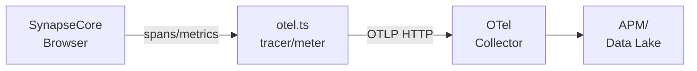

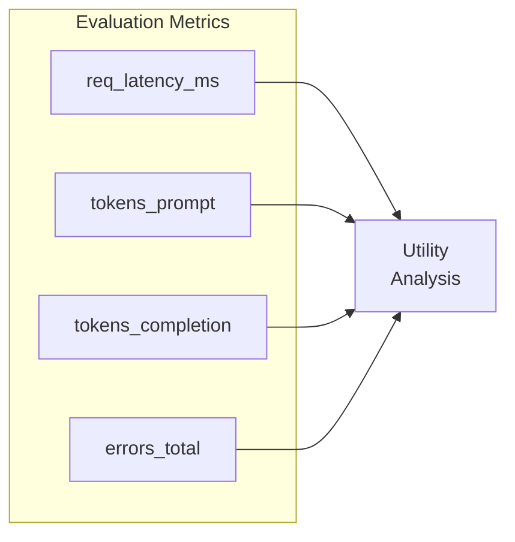

---


## Project Status, Roadmap, and Contributing

### Status
Active research/workbench suitable for pilots, education, and QI projects. Production hardening (auth, EHR integration) is deployment‑specific.

### Roadmap (rationale)
- **EHR/FHIR integration and CDS hooks:** enable structured export and clinical decision support pathways aligned with institutional governance.
- **Longitudinal MBC dashboards and cohorts:** track symptom trajectories across visits; support panel management and stepped care.
- **Expanded scale library:** include additional validated measures (sleep, mania, clinician‑rated PTSD) with explicit anchors and flags.
- **Prompt templates and provenance:** standardize AI prompts with versioned templates and display provenance in UI.
- **Offline‑first and encrypted local persistence:** allow constrained environments to use MBC/flows without network connectivity.
- **Formal test harness for flows/guardrails:** unit and snapshot tests for calculator correctness and redaction stability.

### Contributing
- Open an issue describing scope, clinical rationale, and technical plan.
- Coding style: strict TypeScript, ESLint/Prettier; run `npm run lint` and `npm run type-check`.
- Testing: add unit tests for calculators and deterministic flow builders where feasible.
- Privacy/safety: use non‑PHI sample data and maintain neutral, policy‑conformant wording.
- New scales: follow the `coerce/sum/bands` pattern in `calculators.ts`; document anchors and flags.

License: see `LICENSE` ([ADD LICENSE TYPE IF MISSING]).

---

## Citation and Academic Use

Suggested citation text:

> SynapseCore: A Digital Psychiatry Workbench for Measurement‑Based Care and Multi‑Model AI Orchestration. Version [ADD VERSION], commit [ADD SHORT SHA], [YEAR]. URL: [ADD REPO URL].

BibTeX example:
```bibtex
@software{synapsecore_workbench,
  title   = {SynapseCore: Digital Psychiatry Workbench},
  author  = {[ADD AUTHORS]},
  year    = {[YEAR]},
  version = {[ADD VERSION]},
  note    = {Commit [ADD SHORT SHA]; Measurement-based care; AI orchestration; React/TypeScript},
  url     = {[ADD REPO URL]}
}
```

Teaching and research contexts: suitable for OSCE training, digital psychiatry seminars, and methods papers on AI‑assisted documentation and structured flows when used with appropriate safety governance.

---

## Appendix / Glossary / FAQ


### Glossary
- **MBC:** Measurement‑Based Care — routine use of validated scales to guide treatment.
- **PHQ‑9 / GAD‑7 / PCL‑5 / Y‑BOCS / AUDIT‑C:** Common validated scales for depression, anxiety, PTSD symptoms, OCD severity, and alcohol use.
- **LLM:** Large Language Model.
- **JSON mode:** Provider feature to bias outputs toward strict JSON (supported by OpenAI in this repo).
- **Streaming:** Server‑sent token deltas enabling low‑latency UI updates.
- **OTEL/OTLP:** OpenTelemetry instrumentation and its HTTP/gRPC export protocol.
- **FHIR:** Fast Healthcare Interoperability Resources (EHR data standard).

### FAQ (technical)
- **How can I plug in a new AI provider?**
  1) Implement `Adapter` in `src/services/ai/adapters` (see `types.ts`). 2) Add a provider client in `src/ai/providerClients/*` if you need dynamic model listing. 3) Register capability in `src/ai/modelRegistry.ts` (caps + default models). 4) Extend `buildProviderRequest` in `src/ai/samplingMapper.ts`. 5) Add parameter mapping in `src/services/ai/param-normalizer.ts` as needed.

- **How can I add a new psychometric scale?**
  Follow the pattern in `calculators.ts`: coerce/clamp inputs, compute total, define `bands`, return `{ total, severity, bands, flags }`, and extend `MeasureId` plus `renderAutoscoreHTML` to support HTML rendering and anchors.

- **How do I completely disable network calls for AI?**
  Use local Ollama only or disable AI features via the kill switch: set `VITE_CONSULTON_DISABLE=1`. Ensure no cloud provider keys are present; `useAiStreaming` will skip providers without keys and favor local runtime options.

- **Where are provider keys stored?**
  This repo does not hard‑code key storage. Keys can be injected via environment in some deployments or entered in a settings store. [DESCRIBE LOCAL DEPLOYMENT POLICY HERE]

---

### FAQ (clinical/psychometric)

- **Does SynapseCore give treatment recommendations or risk scores?**  
  No. The MBC engine provides transparent scores and severity bands; flows provide structured wording. Neither produce treatment plans, medication recommendations, or numerical risk scores.

- **Can I adapt the wording of flows to local policies?**  
  Yes. Flow builders under `src/centerpanel/Flows/builders/*` can be edited to align with institutional language, provided that changes are reviewed for clarity and neutrality.

- **How should I interpret a PHQ‑9 or GAD‑7 score in this app?**  
  Interpretation should follow published guidance and local policy. The app’s role is to compute scores and label severity bands; it does not interpret scores for an individual patient.

- **Is the session ML model a predictor of clinical outcome or risk?**  
  No. The `useSessionML` hook models time‑allocation patterns (e.g., typical segment sequences) for convenience only; it does not encode or predict clinical risk, response, or outcomes.


